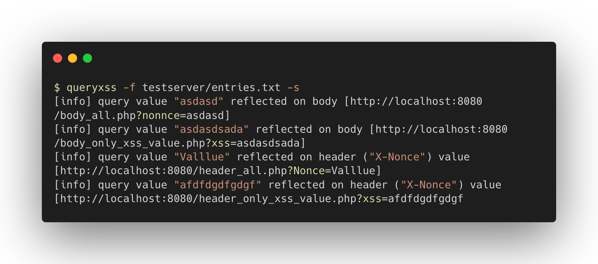

# QueryXSS

QueryXSS is a tool to test for reflected inputs in the response.

**Beware:** This tool is still in development, so you can expect bugs.



## Usage

```bash
$ queryxss -h                                    
QueryXSS finds reflected values in the HTTP response.

Usage:
  queryxss [flags]

Flags:
  -k, --allow-insecure       Allow insecure connections
  -d, --debug                Enable debug mode
  -f, --file string          File with URLs to scan
  -H, --header stringArray   Headers to send with the request (specify multiple times)
                             Example: -H 'X-Forwarded-For: 127.0.0.1' -H 'X-Random: 1234'
  -h, --help                 help for queryxss
  -m, --min-length uint      Minimum value's length to scan for reflections (default 3)
  -n, --no-color             Disable color output
  -r, --rate-limit uint      Number of requests per second (default 25)
  -s, --silent               Outputs only errors and the results
```

## Install

### Using go install

Make sure you have [Go installed and configured](https://go.dev/doc/install).

```bash
go install github.com/vitorfhc/queryxss/cmd/queryxss@latest
```

### Manual install

```bash
git clone github.com/vitorfhc/queryxss
cd cmd/queryxss
go install
```